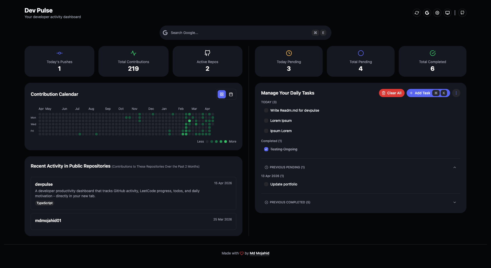

<h1 align="center">DevPulse</h1>

<p align="center">
  <strong>Your productivity hub in every new tab</strong>
</p>

<p align="center">
  A Chrome extension that transforms your new tab into a developer dashboard with GitHub activity, todos, and a built-in notes manager.
</p>

<p align="center">
  <a href="https://devpulse.mojahid.dev/"></a>
  <a href="./LICENSE"></a>
  
  
  <a href="https://github.com/mdmojahid01/devpulse/issues"></a>
  <a href="https://github.com/mdmojahid01/devpulse/pulls"></a>
  
</p>

<p align="center">
  <a href="https://devpulse.mojahid.dev/">devpulse.mojahid.dev</a>
</p>





## Features

- **GitHub Activity** — Visualize your contributions and recent activity
- **Smart Todos** — Date-wise organization with pending task tracking
- **Notes** — Create and manage markdown notes with full-text search
- **Theme Support** — Light/Dark mode with HeroUI v3

### Upcoming Features

- **LeetCode Stats** — Track your coding progress _(coming soon)_
- **Motivational Quotes** — AI-generated or custom quotes based on your activity _(coming soon)_
- **Reading List** — Save articles to read later _(coming soon)_


## Quick Start

### Prerequisites

- Node.js 18+
- Chrome/Edge browser

### Installation

```bash
# Clone the repo
git clone https://github.com/mdmojahid01/devpulse.git
cd devpulse

# Install dependencies
npm install

# Build the extension
npm run build
```

### Load in Chrome

1. Open `chrome://extensions/`
2. Enable **Developer mode**
3. Click **Load unpacked**
4. Select the `dist` folder


## Development

```bash
# Start dev server
npm run dev

# Lint & format
npm run lint
npm run format
```


## Tech Stack

- **React 19** + **TypeScript** + **Vite**
- **HeroUI v3** — Modern UI components
- **Tailwind CSS v4** — Styling
- **@uiw/react-md-editor** — Markdown editor with live preview
- **Chrome Extension Manifest v3**


## Project Structure

```
src/
├── pages/         # Main page components
├── components/    # Reusable UI components
├── hooks/         # Custom React hooks
├── services/      # API & storage services
└── lib/           # Utilities & helpers
```


## Contributing

Contributions are welcome! Feel free to:

- Report bugs
- Suggest features
- Submit pull requests


## License

AGPL-3.0 © [Md Mojahid](https://www.linkedin.com/in/mdmojahid01/)


<div align="center">
  Made with ❤️ by developers, for developers
</div>
